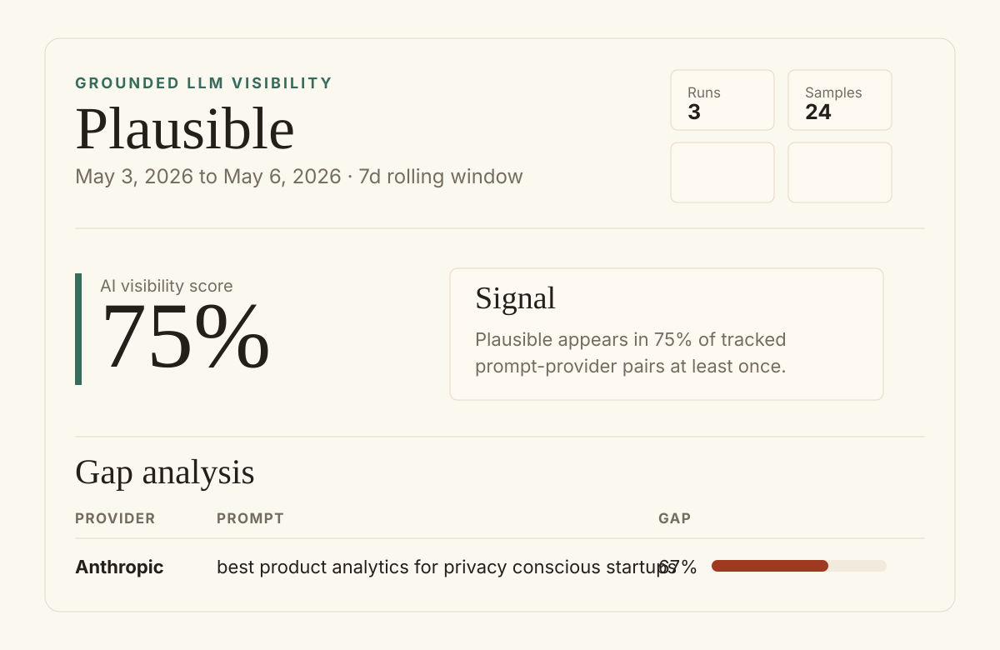

# openllmrank

[](https://www.npmjs.com/package/openllmrank)
[](./LICENSE)
[](./test)

> **AI-search-visibility tracking that costs $5/month instead of $500/month.**
> Self-hosted CLI. Bring your own API keys. The Plausible of AI search.

**The problem.** When users ask AI tools for product recommendations, your brand either gets cited or it doesn't. Existing AI-search-visibility tools (Profound, Athena HQ, Brand Radar) cost $200–$1,000/month. You can do this yourself for the cost of a few API calls a week.

**The pitch.** A 30-second install. Define your brand, your competitors, and a list of prompts users would actually search. `openllmrank run` queries grounded LLM APIs with web search enabled, parses citations, and writes:

- A **gap-analysis report** showing prompts where competitors get cited and you don't
- A **suggestions report** that fetches the winning competitor's actual page and produces specific content recommendations to close the gap

Run it weekly. Watch the numbers move as you ship content.

## Status

**v0.2** — OpenAI Responses API + Anthropic Messages API, both with web search. Gemini and Perplexity adapters coming. PRs welcome (see [CONTRIBUTING.md](./CONTRIBUTING.md)).

## Requirements

- [Bun](https://bun.sh) 1.3 or later (the CLI is a TypeScript file executed by Bun; Node is not supported yet).
- An OpenAI API key with billing/credit ([create one](https://platform.openai.com/api-keys)). Optional: an Anthropic API key ([create one](https://console.anthropic.com/settings/keys)) to also query Claude.

## Cost expectation

A typical run with default config (5 prompts × 1 provider × N=3 samples = 15 grounded calls) costs **about $0.40-$0.50 with OpenAI's `gpt-4o-mini` + web_search**. The web-search tool fee dominates over token cost; the per-call fee is roughly $0.025. Two providers doubles it. Running once a week means **~$2-5/month per tracked brand**. Compare to $200-1000/month for hosted alternatives.

## Install

From npm:
```bash
bun install -g openllmrank
```

From GitHub (latest main, including unpublished commits):
```bash
bun install -g github:foodaka/openllmrank
```

From source (for development):
```bash
git clone https://github.com/foodaka/openllmrank.git
cd openllmrank
bun install
bun link
```

## Quick start

```bash
mkdir my-brand && cd my-brand
openllmrank init
# edit openllmrank.config.json with your brand, competitors, prompts
echo 'OPENAI_API_KEY=sk-...' > .env
openllmrank run                   # query providers, persist results
openllmrank report                # markdown gap analysis
openllmrank report --html         # self-contained HTML report
openllmrank suggest               # NEW: actionable content recommendations
open gap-report.html suggestions.md
```

## Commands

| Command | What it does |
|---------|--------------|
| `openllmrank init` | Write a starter config and `.env.example` |
| `openllmrank run` | Query each prompt × provider × N samples, persist to SQLite |
| `openllmrank run --resume` | Resume the previous unfinished run from where it crashed |
| `openllmrank run --retry-failed` | Re-query just the failed rows from the latest run |
| `openllmrank report` | Generate `gap-report.md` from the rolling 7-day window |
| `openllmrank report --html` | Generate a self-contained `gap-report.html` with no CDN, font, CSS, or JS dependencies |
| `openllmrank suggest` | **NEW.** For each losing prompt, fetch the winning competitor's cited URL and your brand URL, and produce specific content recommendations |
| `openllmrank export --since 7d` | Emit raw calls + citations as NDJSON for piping to `jq`/spreadsheets |

## HTML reports

The HTML report is designed for sharing in Slack, email, or a browser without any network access:

```bash
openllmrank report --html
openllmrank report --html --output weekly-ai-visibility.html
```

It includes the AI visibility score, trend versus the previous run, the losing gap table with expandable raw responses, winning prompts, provider breakdowns, run-history sparklines, and total run cost. See [examples/sample-report.html](./examples/sample-report.html).



## suggest in detail

After a `run`, `suggest` analyzes your biggest gaps:

```bash
openllmrank suggest                          # top 3 losing prompts
openllmrank suggest --top 5                  # top 5
openllmrank suggest --prompt "office step"   # filter to one prompt (substring match)
openllmrank suggest --output ideas.md
```

Under the hood, for each losing prompt it:

1. Picks the winning competitor's most-cited URL from the citations table (or falls back to the competitor's primary domain alias from your config when no URL citation exists)
2. Fetches that page and your brand's main URL via plain HTTP (no headless browser, no dependency on Chromium)
3. Checks `robots.txt` per origin and skips disallowed paths
4. Extracts main content with cheerio (skips nav/footer/script/style)
5. Sends both pages to GPT for structured comparison, with the scraped HTML clearly delimited and marked as untrusted to defend against prompt-injection attempts on competitor pages
6. Writes a markdown file with: why the competitor wins, concrete content gaps, and 3-5 specific recommendations per losing prompt

Cost: ~$0.005 per losing prompt analyzed (uses plain chat completions, not grounded calls).

JS-rendered sites: if a fetched page returns < 200 chars of extractable content and looks like an SPA, that page is skipped with a clear note rather than failing the whole run.

## How it works

1. You define a brand, competitors, and prompts in `openllmrank.config.json`.
2. `openllmrank run` queries each prompt against each provider with web search enabled, N times for sample variance.
3. Results are stored in a local SQLite database with content-addressed prompt IDs (so editing a prompt creates a new tracking series rather than corrupting old data).
4. `openllmrank report` generates a markdown gap-analysis: prompts where competitors are cited but you are not.

## Choosing good prompts

The quality of your insight is determined almost entirely by your prompt list. Bad prompts produce vanity metrics. Five things to know:

**Prompts that work** — these surface real visibility signal:
- **Category prompts.** "best X tools" / "top Y for Z" — the AI has to choose what to mention.
- **Alternatives prompts.** "alternatives to [a competitor]" — exposes who shows up in the long tail.
- **Persona prompts.** "fitness app where I can race friends in steps" — captures intent-driven discovery.
- **Forced-choice prompts.** "top 3 enterprise X platforms for a 500-person company" — forces a ranking.

**Prompts that don't work** — drop these from your config:
- **Named comparisons.** "X vs Y vs Z" — every brand in the prompt gets 100% citation. That's an echo, not signal.
- **Pure how-to.** "how do I set up a step challenge" — long answers, zero brand citations. The AI explains the *task*, not the *products*.
- **Pure objection.** "problems with [category]" — same thing. AI describes problems generically without naming products.

**Test:** if removing every brand name from the prompt would still produce a meaningful answer, it's a good prompt. If removing the brand name kills the prompt, it's an echo.

## After your first run

The first run is your baseline — but it usually surfaces three things to fix in your config:

1. **Competitors you didn't list.** Read 2-3 raw responses. If a brand name appears repeatedly that you didn't track, add it to your `competitors` array. Your gap analysis is undercounting until you do.
2. **Prompts that produced no citations from anyone.** Drop them and replace with category/alternatives prompts.
3. **Prompts that produced 100% citations across the board.** They contain brand names — strip the names or replace with open-ended versions.

Iterate the config 1-2 times before you treat the data as a baseline to track over time.

## Architecture

- **Bun + TypeScript**, single binary via `bun build --compile`
- **SQLite** via `bun:sqlite` (zero external deps)
- **Provider contract** in `src/core/types.ts` — every provider implements the same interface
- **Normalized errors + central retry** in `src/core/runner.ts` — adapters translate provider errors to a common shape
- **Strict citation parsing** + 20+ fixture suite to prevent silent regressions

## License

MIT.
