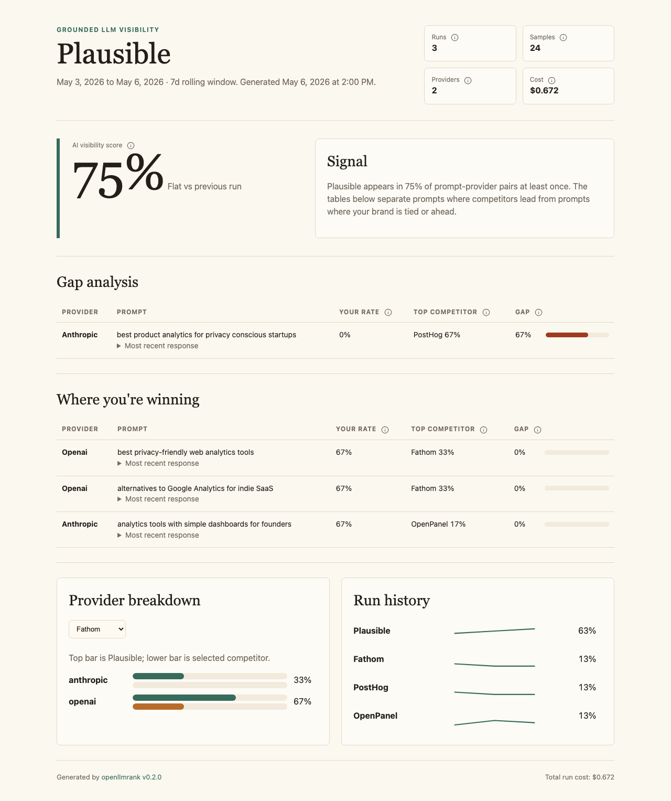

# openllmrank — monorepo

This is the Bun-workspace monorepo for the openllmrank project.

**Hosted version:** [openllmrank.xyz](https://openllmrank.xyz) — one-shot reports without installing the CLI.



## Packages

| Package | Path | Description | Visibility |
|---------|------|-------------|------------|
| `openllmrank` | [`packages/cli`](./packages/cli) | The open-source CLI. Tracks brand visibility across grounded OpenAI, Anthropic, Gemini, Perplexity, and Grok APIs. Published to npm. | Public, MIT |
| `@openllmrank/shared` | `packages/shared` | Shared Zod schemas and types used by the CLI and the hosted webapp. | Private |
| `@openllmrank/web` | [`packages/web`](./packages/web) | The hosted Next.js app: marketing, report wizard, checkout, and hosted reports. | Private |
| `@openllmrank/worker` | [`packages/worker`](./packages/worker) | The Bun worker that runs reports, persists results, and delivers report emails. | Private |

## Quick start (CLI users)

See [`packages/cli/README.md`](./packages/cli/README.md). The short version:

```bash
bun install -g openllmrank
openllmrank init
openllmrank run
openllmrank report --html
```

## Working in this repo

```bash
bun install         # install all workspaces (single lockfile at root)
bun test            # run all tests across all packages
bun run typecheck   # typecheck across all packages
```

Test framework is `bun:test` everywhere; tests live in `packages/*/test/`.

## Project documentation

- [Contributing](./CONTRIBUTING.md)
- [Design system](./DESIGN.md)
- [Production deployment](./DEPLOY.md)
- [Worker deployment](./packages/worker/RAILWAY.md)
- [Tracked follow-up work](./TODOS.md)
- [Agent operating notes](./CLAUDE.md)

## License

MIT — see [LICENSE](./LICENSE).
